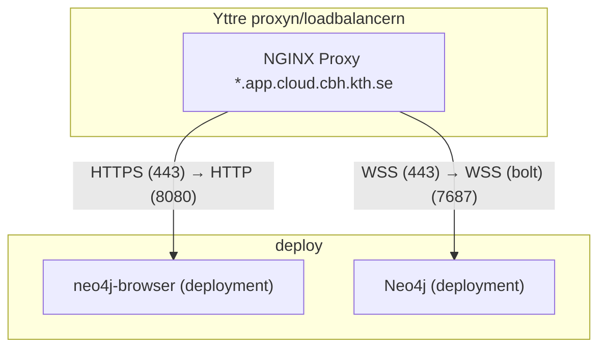

# neo4j test på kthcloud

## Vad gör configsen

Märkte att det funkade direkt genom proxyn. Behövdes bara två olika portar, så jag clonade och fixade en docker image som servar [`neo4j-browser`](https://github.com/neo4j/neo4j-browser), så kan man köra den och sen bara använda bolt porten på `neo4j` deploymenten.



## Deploy step by step

1. Skapa en deployment med imagen: `neo4j:latest`:
    - Sätt en environment variable `NEO4J_AUTH` med värdet `<användarnamn>/<lösenord>`.
    - Sätt en environment variable `NEO4J_server_config_strict__validation_enabled` med värdet `false`.
    - Sätt `PORT` environment variabeln till `7687`, så den lyssnar på bolt porten.
    - Ge den mer ram runt 1GB är det jag har testat, med 0.5 fick jag `oom-exception`, mer cpu kan också vara skönt så man slipper vänta så länge för att det ska starta.
    - Om du vill använda persistent storage kan du mounta `/data`, det går även att mounta `/logs` för logs och `/conf` för konfiguration (`neo4j.conf` bör läggas i mappade mappen för `/conf`)

2. Skapa en deployment med imagen: `phillezi/neo4j-browser:latest`
    - Sätt `PORT` environment variabeln till `8080` (default).

3. Gå in på deployment nr 2 dvs den med `phillezi/neo4j-browser:latest` som image och klicka på `visit`.
    - Nu bör du se `neo4j-browser` och få alternativ för att ansluta till neo4j.
    - Anslut till `<din-neo4j-deployments-namn>.app.cloud.cbh.kth.se:443` med det användarnamn och lösenord du satte i `NEO4J_AUTH`.

Nu bör du ha åtkomst till neo4j.


## Deploya med `kthcloud-cli`

> [!NOTE]
> Namnen måste vara unika i `kthcloud.docker-compose.yml` så ändra dom om du vill deploya från den.

```bash
kthcloud login # logga in
# öppna storage managern i browsern så vi kan sno cookies
kthcloud compose sm check   # om den inte ger Passed så försök igen (funkar ej på windows)
                            # alternativit kan man manuellt skapa mapparna via browsern
kthcloud compose up --try-volumes   # try volumes flaggan försöker skapa mapparna och filerna som ska mountas
                                    # lägg till -d om du vill detatcha från deploymentsen, default betende ger SSE strömmar med logs från alla deployments
                                    # ctrl/cmd + c kan användas för att detactha och man har då möjligheten att disablea deploymentsen
kthcloud compose down  # tar ner alla deployments som beskrivs i filen
``` 
