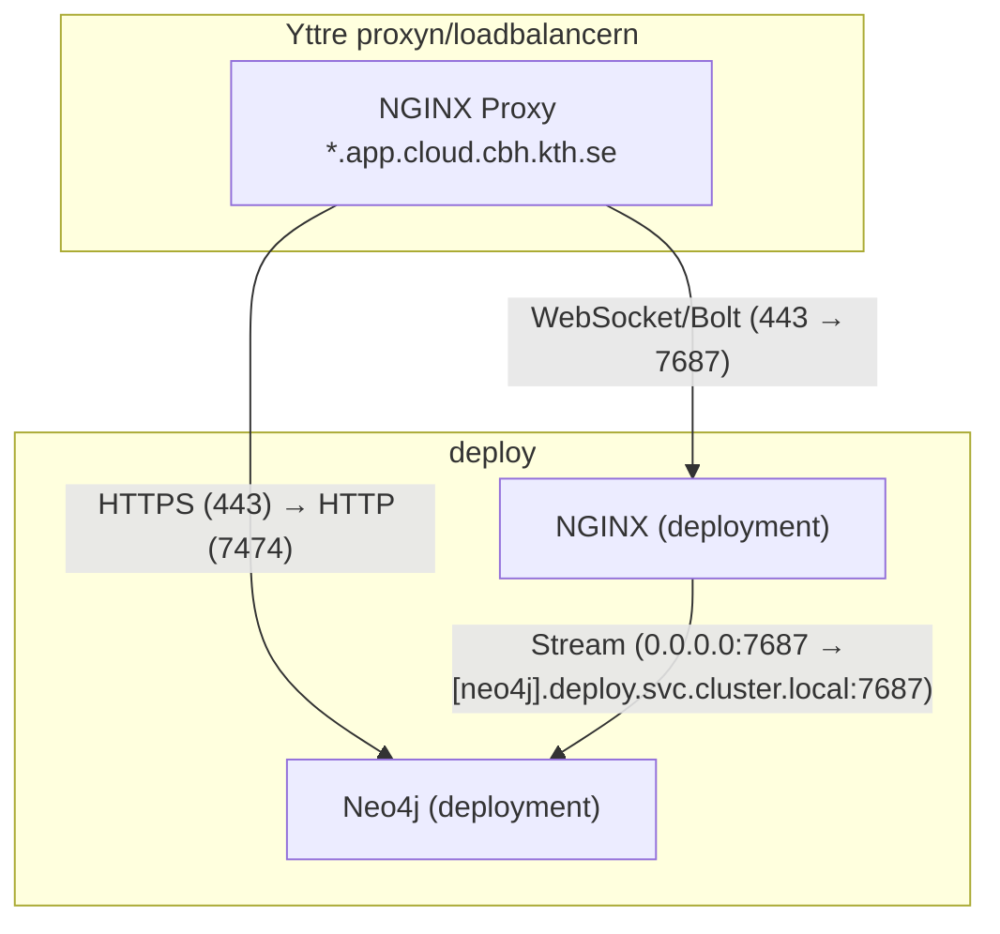

# neo4j test på kthcloud

## Vad gör configsen



## Deploya med `kthcloud-cli`

> [!NOTE]
> Namnen måste vara unika i `kthcloud.docker-compose.yml` så ändra dom om du vill deploya från den.

```bash
kthcloud login # logga in
# öppna storage managern i browsern så vi kan sno cookies
kthcloud compose sm check   # om den inte ger Passed så försök igen (funkar ej på windows)
                            # alternativit kan man manuellt skapa mapparna via browsern
kthcloud compose up --try-volumes   # try volumes flaggan försöker skapa mapparna och filerna som ska mountas
                                    # lägg till -d om du vill detatcha från deploymentsen, default betende ger SSE strömmar med logs från alla deployments
                                    # ctrl + c kan användas för att detactha och man har då möjligheten att disablea deploymentsen
kthcloud compose down  # tar ner alla deployments som beskrivs i filen
``` 